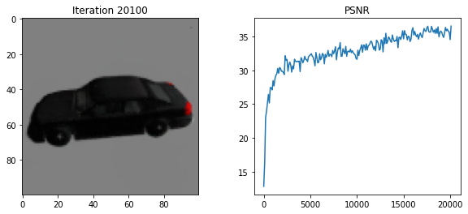

# PyTorch NeRF

This repository contains a minimal PyTorch implementation of the NeRF model described in "[NeRF: Representing Scenes as Neural Radiance Fields for View Synthesis](https://arxiv.org/abs/2003.08934)".
While there are other PyTorch implementations out there (e.g., [this one](https://github.com/krrish94/nerf-pytorch) and [this one](https://github.com/yenchenlin/nerf-pytorch)), I personally found them somewhat difficult to follow, so I decided to do a complete rewrite of NeRF myself.
I tried to stay as close to the authors' text as possible, and I added comments in the code referring back to the relevant sections/equations in the paper.
The final result is a tight 374 lines of heavily commented code (320 sloc—"source lines of code"—on GitHub) all contained in [a single file](run_nerf.py). For comparison, [this PyTorch implementation](https://github.com/krrish94/nerf-pytorch) has approximately 970 sloc spread across several files, while [this PyTorch implementation](https://github.com/yenchenlin/nerf-pytorch) has approximately 905 sloc.

[`run_tiny_nerf.py`](run_tiny_nerf.py) trains a simplified NeRF model inspired by the "[Tiny NeRF](https://colab.research.google.com/github/bmild/nerf/blob/master/tiny_nerf.ipynb)" example provided by the NeRF authors.
This NeRF model does not use fine sampling and the MLP is smaller, but the code is otherwise identical to the full model code.
At only 171 sloc, it might be a good place to start for people who are completely new to NeRF.

A Colab notebook for the full model can be found [here](https://colab.research.google.com/drive/1oRnnlF-2YqCDIzoc-uShQm8_yymLKiqr?usp=sharing), while a notebook for the tiny model can be found [here](https://colab.research.google.com/drive/1ntlbzQ121-E1BSa5EKvAyai6SMG4cylj?usp=sharing).
The [`generate_nerf_dataset.py`](generate_nerf_dataset.py) script was used to generate the training data of the ShapeNet car.

For the following test view:

[`run_nerf.py`](run_nerf.py) generated the following after 19,500 iterations (a few hours on a P100 GPU):

**Loss**: 0.00022201683896128088

while [`run_tiny_nerf.py`](run_tiny_nerf.py) generated the following after 19,600 iterations (~35 minutes on a P100 GPU):

**Loss**: 0.0004151524917688221

The advantages of streamlining NeRF's code become readily apparent when trying to extend NeRF.
For example, [training an "object-centric NeRF"](run_tiny_obj_nerf.py) (i.e., where the *object* is rotated instead of the camera) only required making a few changes to [`run_tiny_nerf.py`](run_tiny_nerf.py) bringing it to 181 sloc (notebook [here](https://colab.research.google.com/drive/1fbn0DCVA1nMOcqEltTyjbBhSzsttaDqA?usp=sharing)).
However, for some reason, I have yet to be able to reproduce the results from [pixelNeRF](https://github.com/sxyu/pixel-nerf), so if you spot a bug in [`run_pixelnerf.py`](run_pixelnerf.py), please let me know!
